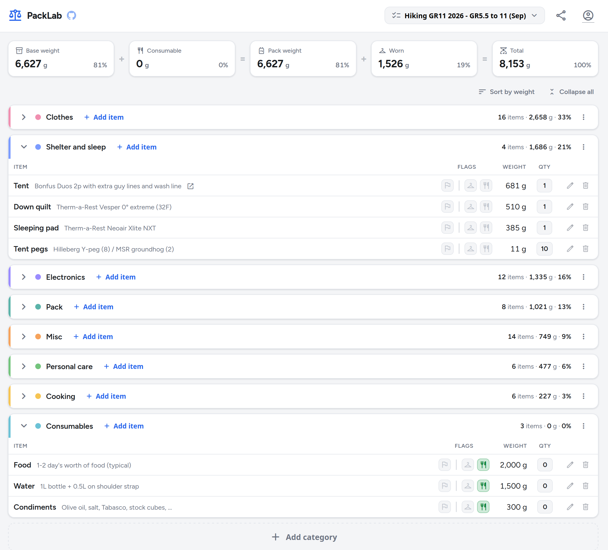

# PackLab.app - gear list editor

<p align="center">
  <a href="https://packlab.app"><strong>🚀&nbsp; Try the live demo &nbsp;→</strong></a><br>
  <sub>log in with <code>demo</code> / <code>demo</code> — no signup, have a poke around</sub>
</p>

> 🔒 **Closed beta** — accounts are invite-only for now; anyone can try the [demo](https://packlab.app) above.

Sunday vibe-coding project: a modern looking LighterPack alternative with some bugs fixed,
better mobile editing, and a few personal preferences baked in — most notably
weights in grams only.

I might add oz/lb/stones/slugs/weys later — but until I do, you're spared from ever learning that 1 wey = 6.5 tod = 13 stone = 182 lb = 82.554 kg. **SI** only for now. You're welcome.



The CSV files are **two-way compatible** with LighterPack: you can import a LighterPack export here and export a file that imports back into LighterPack. However, on import, **weights in oz/lb/kg are converted to grams**
Unlike LighterPack, PackLab actually uses the flag columns in the CSV (which LighterPack writes but ignores), and adds a few of its own flags. LighterPack ignores the extra ones on import, so round-tripping is lossy in that direction only.

Most of the code was written by Claude (Anthropic's Claude Code, model Claude Opus 4.8)

## Run locally

Requires PHP 8+ with `pdo_sqlite`. On Ubuntu/Debian:

```
sudo apt install php-cli php-sqlite3
```

Then:

```
cp config.example.php config.php   # first time only
php -S localhost:8000
```

Then open http://localhost:8000/index.php

The database is created automatically on first run.
